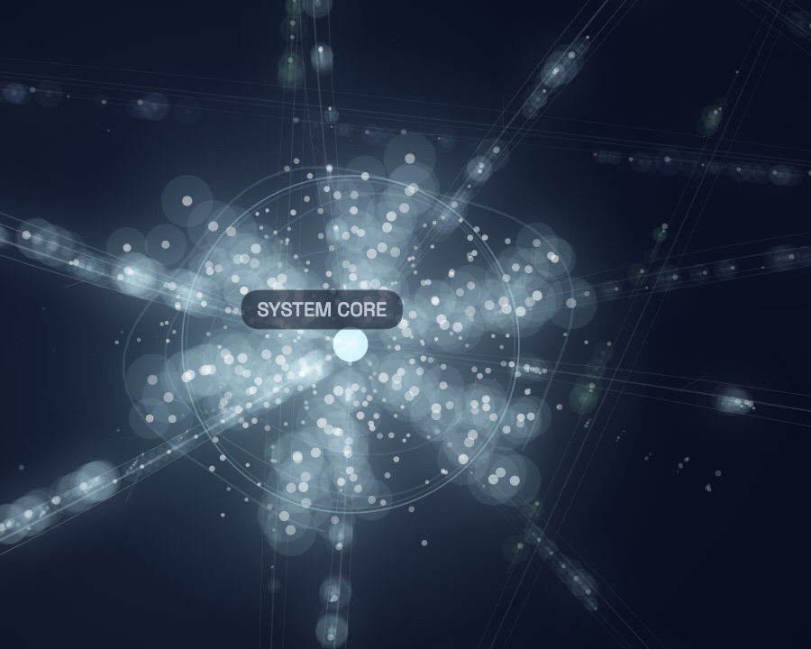

# Signal Field

Signal Field is a local-first macOS system monitor rendered as a living neural/cosmic visualization.

Instead of charts and gauges, it turns your machine's live resource activity into glowing particle-cluster nodes, flowing influence paths, volumetric fog shells, and process micro-constellations.

Built with React, Vite, TypeScript, Canvas 2D, Zustand, and Electron.

## Screenshots




## What It Shows

- CPU load
- memory usage
- battery state and pressure
- thermal state
- disk usage and disk I/O
- network traffic
- top active processes
- GPU hardware metadata

## What Is Real vs Inferred

Real local telemetry:

- CPU load
- memory percent
- battery state/percent
- thermal state
- disk usage
- disk read/write rates
- network in/out rates
- top processes
- GPU model and core count

Interpreted layer:

- subsystem-to-subsystem influence paths
- visual flow strength between nodes
- process-to-resource relationship emphasis

The app uses real local metrics and then derives a relationship graph from them so the field reads like a machine "thinking through itself."

Important limitation:

- live GPU activity is still inferred, not true real-time GPU utilization

## Stack

- React 18
- TypeScript
- Vite
- Tailwind CSS
- Zustand
- Electron
- systeminformation

## Run Locally

```bash
npm install
npm run dev
```

## Run The Desktop App In Dev

```bash
npm install
npm run desktop:dev
```

Note:

- `desktop:dev` is for development only
- the normal packaged app does not require any scripts to run

## Build The macOS App

```bash
npm install
npm run desktop:build
```

The packaged app bundle is generated in:

```text
release/mac-arm64/Signal Field.app
```

## Install The App

After building, move or copy the app into:

```text
/Applications/Signal Field.app
```

Then launch it like any normal Mac app from:

- Applications
- Spotlight
- Dock

## How It Works

The renderer is a single canvas-based visualization.

- resource wells are particle spheres
- influence edges are computed from live metrics
- streams animate along weighted subsystem paths
- process satellites orbit the process region
- fog shells and glow layers add depth

The supporting UI is HTML/CSS, but the actual field is canvas-driven.

## Project Structure

```text
electron/
  main.cjs
  preload.cjs

src/
  components/
    NeuralFieldCanvas.tsx
    SystemOverlay.tsx
  hooks/
    useAnimationLoop.ts
    useInteraction.ts
    useSystemSnapshot.ts
  lib/
    influenceGraph.ts
  pages/
    App.tsx
  store/
    useAppStore.ts
  types/
    system-monitor.d.ts
```

## Notes

- This project is currently macOS-oriented because the app shell is Electron and the telemetry assumptions were built around a Mac workflow.
- The visual language is intentionally cinematic rather than purely utilitarian.
- The repo includes a `CODE_SCROLL.md` file if you want a single-file read-through of the project source.

## Roadmap

- stronger selected-node focus mode
- better GPU telemetry if a reliable local source is added
- mobile/web viewer mode
- custom app icon and more polished app branding
- exportable recordings and screenshots
